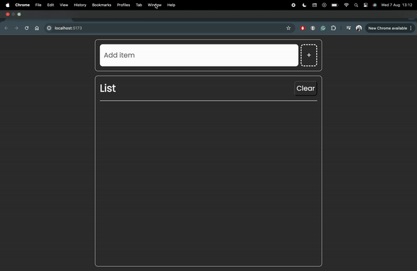

# TypeScript List
I developed this fully functional to-do list application as a project to enhance my TypeScript skills.

## Lessons Learned:
Through this project, I significantly improved my proficiency as a software developer. By utilising TypeScript, I enhanced my code's type safety, making it more maintainable and secure. I applied various techniques, including type annotations, interfaces, generics, type assertions, singleton patterns, access modifiers, and type guards. I chose a model-template architecture and kept the implementation straightforward by using local storage as the database. This approach not only streamlined the development process but also reinforced best practices in software design and development.

## Possible Additions:
Future enhancements for this project could involve reworking it with React to create more maintainable and scalable code. Additionally, incorporating AI features could add significant value. For instance, the application could summarize all activities on the list or automatically rearrange tasks based on their importance.

# Notes:
npm start to start server.

]
